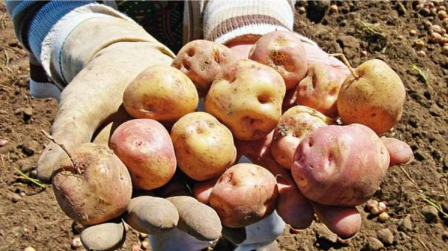

### Instrucciones

Resolver todo el ejercicio en el archivo llamado papa.wlk, analizando previamente los nombres de objetos y mensajes utilizados en el archivo de test llamado papa.wtest de modo que los mismos puedan correr correctamente. Agregar en el mismo archivo de test, los test necesarios para el resto de los objetos.

# Cotización de la papa

**Ni la soja, ni el litio, ni vaca muerta, ni miles de laburantes que exporten su fuerza de trabajo convertida en software… para fomentar el ingreso de divisas al país la solución es la exportación de papa. (el tubérculo, no el que "exportamos" al Vaticano… 😃)**

Se cuenta con la información de toda la producción de papa de un conocido país y se quiere averiguar el importe total que se obtiene al exportarla, dependiendo de circunstancias cambiantes del mercado y de las políticas económicas vigentes. En concreto, el importe se calcula como su costo de producción más un valor de impuesto, más un valor por derechos de exportación.

## Producción

El costo de producción depende de la calidad y cantidad de la cosecha. La cantidad de unidades cosechadas es un valor determinado. Respecto de la calidad, si se considera que la papa es buena son $3 por cada unidad; pero si es regular se usa como importe unitario la cotización que da el "Protectorado Especial de Productos de Exportación" (pepe). La calidad premium tiene un importe por unidad 50% mayor a la calidad buena.

## Impuestos

La forma de calcular el impuesto puede ir cambiando, por ahora con estas posibilidades, pero podrían ser más:

- Simple: 10% del costo de producción.
- Con Garantía: 5% del costo de producción, pero nunca menos de $100.
- Inventada: Agregar una nueva modalidad impositiva

## Derechos de exportación

El importe de los derechos de exportación, también llamados retenciones, se calcula de diferentes maneras:

- Estatista: $200 pesos si el costo de producción es alto (mayor a $1000)  y 300$ en caso contrario.
- Privatizador: Un monto básico de 50$ más $1 peso adicional por cada 10 unidades cultivadas. 
- Demagógico: Actualmente son $100 pero podría cambiar en cualquier momento.
- Nulo: Nada.

## Batería de tests

Para conocer el importe total de exportación la cantidad de combinaciones posibles son inmensas. Parecería que las clases de equivalencia son muchísimas. Sin embargo, la teoría de Testeo Unitario nos dice que si probamos cada parte por separado, no es necesario probar todas las combinaciones.

- A. Entonces, les proponemos que tomen una parte (ya sea la parte del cálculo del costo de producción, o la de los impuestos o la de derechos) y para esa parte sí escriban todos los tests considerando todas las clases de equivalencia.

- B. Además, hacer un test que muestre cómo funciona un caso del cálculo del importe total de exportación, que es el objetivo de todo esto.

# Más cotizaciones

**Como si no fuera suficiente, se decidió contemplar otros productos de exportación**

## Batata

El importe total de la batata se calcula a partir de un costo de producción preestablecido, (no hace falta considerar ni la cantidad ni la calidad) al que se le suman los impuestos, pero no está sujeta a derechos de exportación. Los impuestos son el simple y el de garantía, al igual que la papa, y se agrega una nueva posible modalidad: el impuesto compuesto (inventar una nueva forma de calcularlo que requiera de algún nuevo objeto o mensaje, pero que no sea necesario modificar nada de lo realizado anteriormente)

## Zapallo

El importe total del zapallo se calcula como el costo de producción, que surge de multiplicar la cantidad cultivada por la cotización de PEPE, más los derechos de exportación cuyas alternativas son las mismas que para la papa, pero siempre a mitad de su valor.
